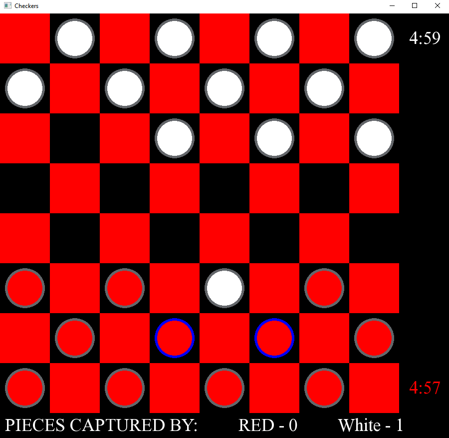
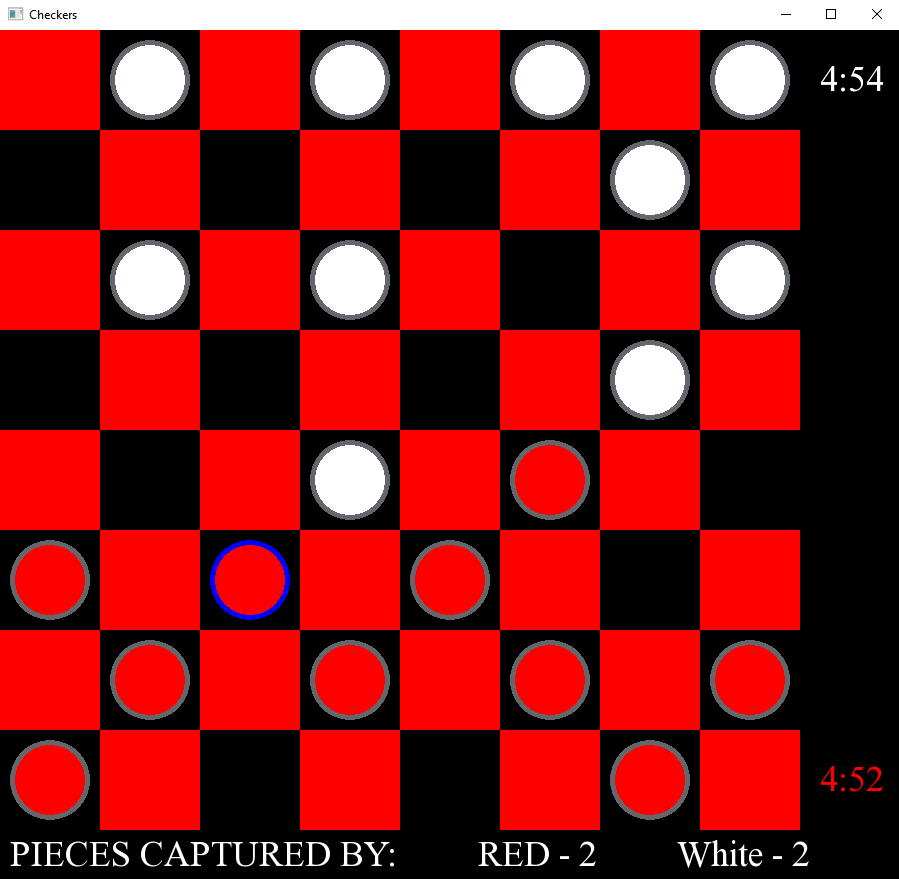
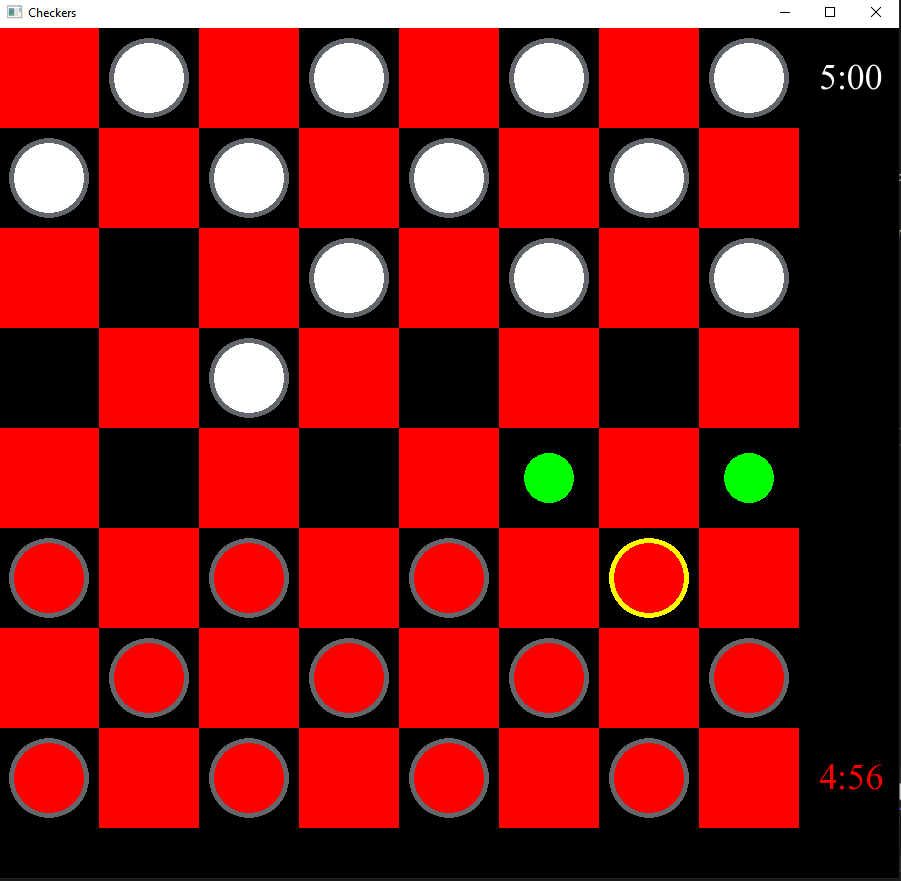
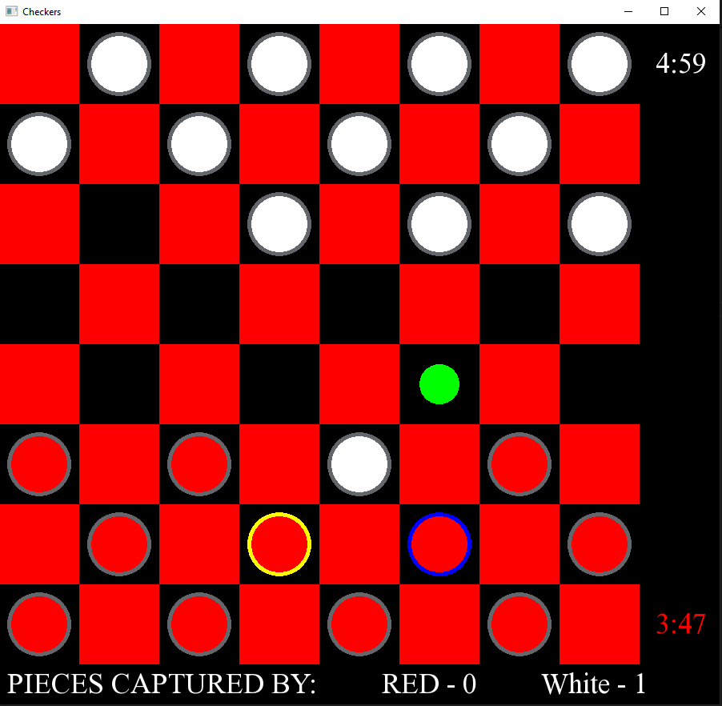
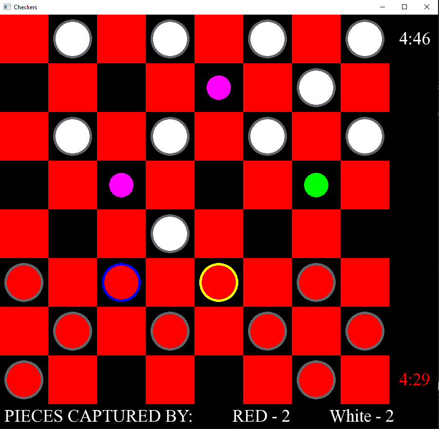
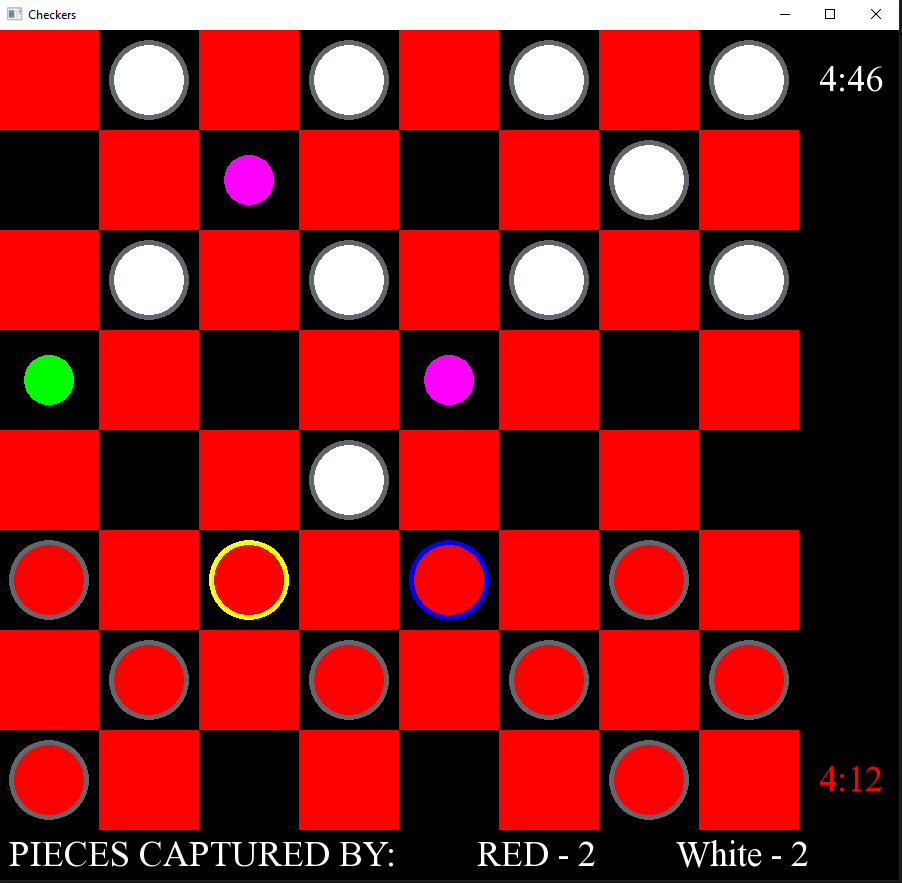

# Checkers-Game
## Overview
American Checkers game using the SFML C++ game library with:
- Mandatory maximum captures
- Backward captures
- 5 minute timer to track players' time moving pieces

## Piece Outlines

### Gray Outline
Normal outline for checkers

### Blue Outline
Maximum jump is found and pieces with blue outline must be moved

Two single jumps are found: 

Only the piece with the most amount of jumps is outlined in blue; the piece to the right of it does not have the longest path:

### Yellow Outline
Yellow outline is the piece that is selected and moves for that piece are displayed (shown below in the moves display)

## Moves display
The green moves are places where the piece can move to 

### Normal Move

### Single Jump

### Multi-Jump

## Classes

### Piece Class
- Kinging
- Takes care of Movement validation / moving piece circle position (normal move, single jump, and multi-jump)
- Drawing pieces onto board
- Handles piece selection 

### Board Class
- Drawing board squares and initializing pieces to boar(vector of vectors of shared pointers to Piece objects) 
- Drawing the moves when piece is selected
- Finding attacks
- Counting and displaying number of pieces taken and handles losing condition (no pieces left)
- Moving piece to board coordinate

### Timer Class
- Tracks timer during current player's turn and displays it to screen
- Handles losing condition when a player runs out of time

